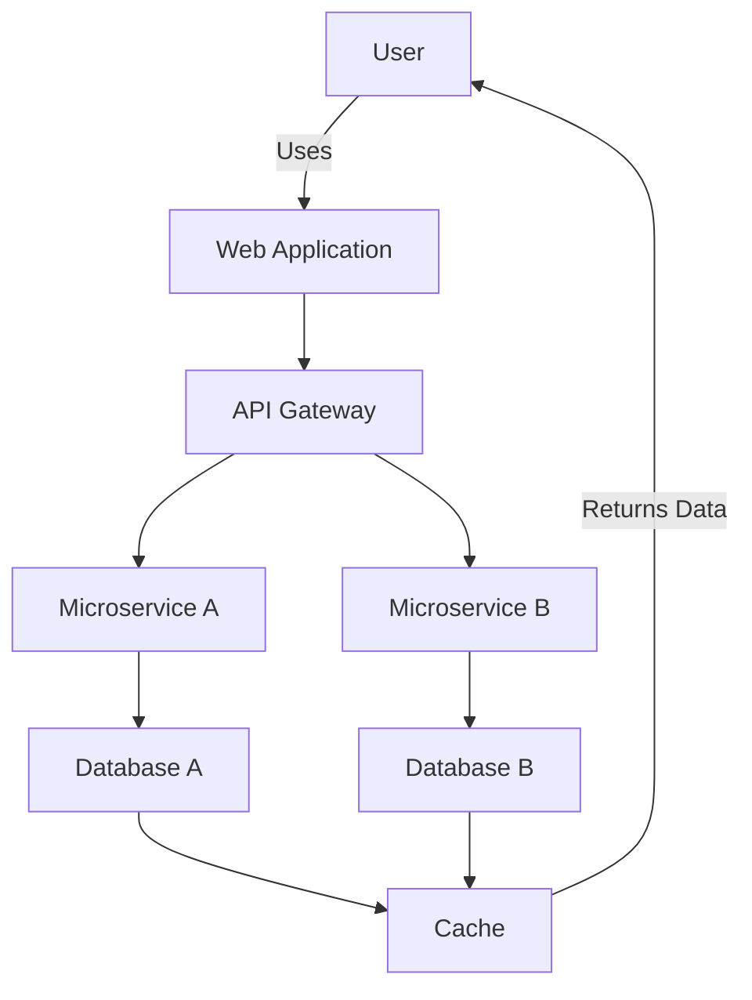

```mermaid
graph TD;
    A[User] -->|Uses| B[Web Application];
    B --> C[API Gateway];
    C --> D[Microservice A];
    C --> E[Microservice B];
    D --> F[Database A];
    E --> G[Database B];
    F --> H[Cache];
    G --> H;
    H -->|Returns Data| A;
```